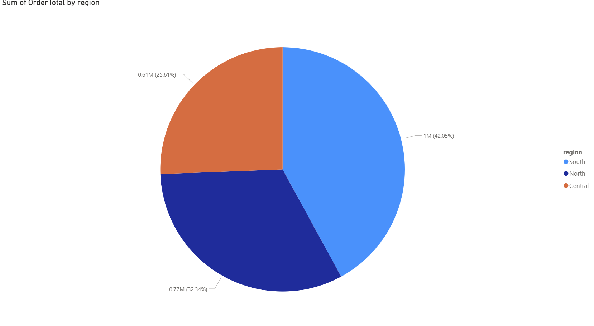
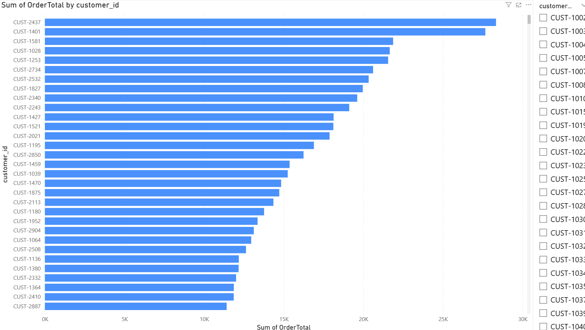
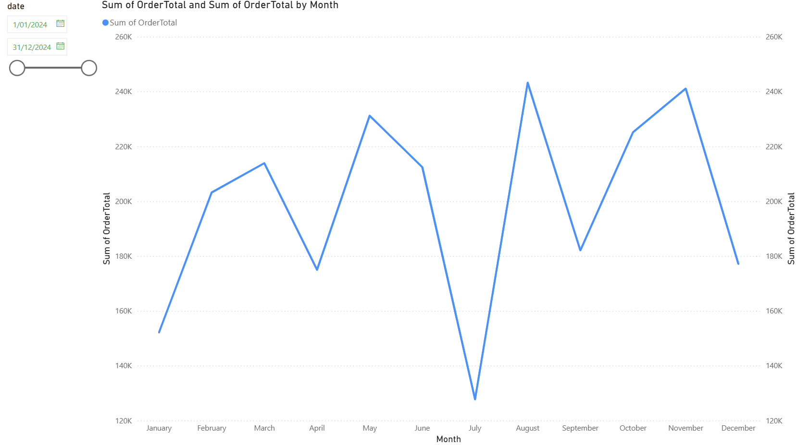
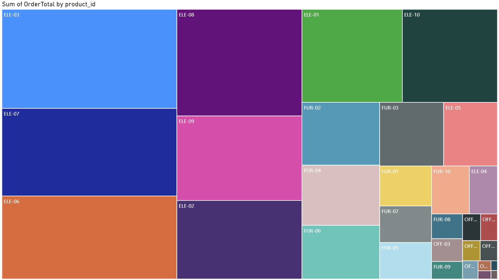

# 📊 Sales Data Analysis

Dự án phân tích dữ liệu bán hàng bằng **Excel, Pandas, SQL và Power BI**.

---

## 1. Mục tiêu
- Làm sạch dữ liệu bán hàng (~2,000 dòng).  
- Tính toán **OrderTotal** cho mỗi đơn hàng.  
- Phân tích doanh thu theo thời gian, khách hàng, khu vực.  
- Trực quan hóa dữ liệu với Power BI.  

---

## 2. Các bước thực hiện
- **Excel**: làm sạch dữ liệu (xoá trùng, xử lý NULL, chuẩn hoá ngày).  
- **Python (Pandas)**: tính toán OrderTotal, merge dữ liệu, exploratory data analysis.  
- **SQL**: truy vấn doanh thu theo khách hàng / thành phố / tháng.  
- **Power BI**: trực quan hóa dữ liệu.  

---

## 3. Dashboard & Kết quả

### 🔹 Doanh thu theo khu vực (Region)

### 🔹 Top khách hàng

### 🔹 Xu hướng doanh thu theo tháng

### 🔹 Doanh thu theo sản phẩm (Treemap)

---

## 4. Kết luận
- **South** là khu vực có doanh thu cao nhất.  
- Một số khách hàng (ID: CUST-2437, CUST-1401, …) chiếm phần lớn doanh thu.  
- Doanh thu có tính mùa vụ, biến động theo từng tháng.  
- Nhóm sản phẩm **Electronics** chiếm tỷ trọng doanh thu lớn nhất.  

